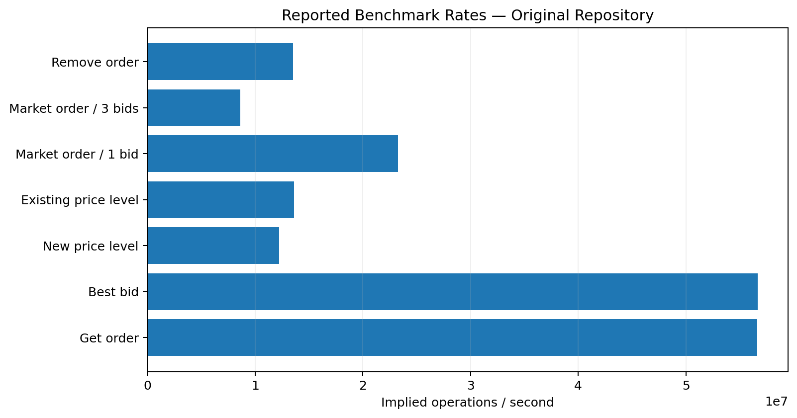
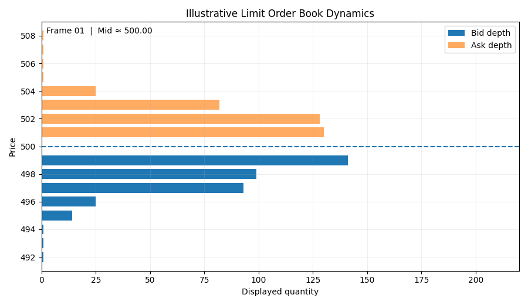
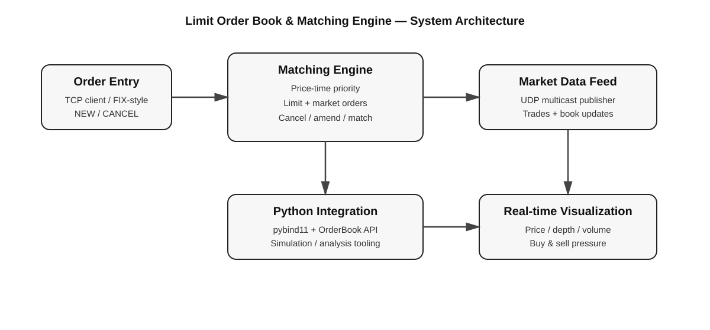

# Limit Order Book & Matching Engine

<p align="center">
  <strong>A high-performance limit order book, matching engine, market-data feed, order-entry gateway, and market simulator.</strong>
</p>

<p align="center">
  
</p>

> **Project note:** This repository is based on the public `jxm35/LimitOrderBook-MatchingEngine` project. The implementation, architecture, and original benchmark results should be treated as upstream work unless you have independently modified and re-benchmarked them. Preserve the upstream license/attribution when redistributing.

---

## ⚡ Overview

This project implements a compact electronic-exchange stack centered around a **price-time-priority limit order book**.

It combines:

- **C++ matching engine** for order-book operations
- **Limit and market orders**
- **Order cancellation and amendment**
- **Multiple instruments**
- **TCP order-entry gateway**
- **UDP multicast market-data publisher**
- **Sequence-aware market-data receiver**
- **Python/pybind11 integration**
- **Synthetic market simulation**
- **Real-time price, depth, and volume visualization**
- **GoogleTest coverage and Google Benchmark performance tests**

The exchange exposes two operating modes: **simulation** and **client orders**.

---

## 🎬 Demo

The GIF below is an **illustrative order-book visualization** showing how displayed bid/ask depth can evolve around a moving mid-price. It is included as a README visual; it is not claimed to be a recording of the upstream executable.

<p align="center">
  
</p>

---

## 🧠 Core Market-Microstructure Concepts

### Limit Order Book

The book maintains:

- **Bids** — buy interest
- **Asks** — sell interest
- **Price levels**
- **FIFO order queues within each price level**
- **Best bid / best ask**
- **Spread**
- **Displayed depth**

The tests explicitly verify FIFO behavior when multiple orders are placed at the same price level.

### Matching

Incoming orders are matched against compatible resting liquidity using price-time priority.

Examples:

```text
BUY  100 @ 101
SELL 100 @ 99
        ↓
      MATCH
```

If the available quantity is larger on one side, the remaining quantity stays in the book.

---

## 🏗️ Architecture

<p align="center">
  
</p>

### Data flow

```text
Order Client
     │
     │ TCP
     ▼
Order Entry Server
     │
     ▼
Matching Engine
     │
     ├──► Order Book
     │
     └──► Market Data Adapter
                │
                ▼
        Market Data Publisher
                │
                │ UDP multicast
                ▼
        Market Data Consumers
```

The exchange also supports a simulation path that creates synthetic activity and feeds orders into the order book.

---

## 📊 Real-Time Visualization

The Python GUI provides a market-monitoring view with:

| Panel | Purpose |
|---|---|
| Price chart | Tracks best bid and best ask over time |
| Depth chart | Displays bid/ask quantities by price level |
| Volume | Displays recent traded volume |
| Statistics | Shows order count, spread, best bid/ask and top-level depth |
| Buy pressure | Injects aggressive buying activity |
| Sell pressure | Injects aggressive selling activity |

The GUI is implemented with **PyQt6 + pyqtgraph**, while the order-book object is exposed through the Python integration layer.

---

## 🧪 Market Simulation

The simulator creates synthetic order flow around the current book.

The simulation:

1. Initializes a two-sided book.
2. Reads the current best bid and ask.
3. Calculates the mid-price and spread.
4. Samples prices around the current market.
5. Places limit orders or market orders.
6. Tracks executions and recent volume.
7. Allows additional buy/sell pressure to be injected.

The source uses a background simulation thread and tracks executed trades with price, quantity, and timestamp.

---

## 🏦 Exchange Server

The `exchange` executable supports:

```bash
./exchange --mode simulation
```

or:

```bash
./exchange --mode client --oe-port 8080
```

Market-data configuration can also be supplied:

```bash
./exchange \
  --mode simulation \
  --md-ip 239.1.1.1 \
  --md-port 9999
```

The exchange currently initializes five instruments:

```text
AAPL
GOOGL
AMZN
NFLX
META
```

Each instrument receives its own `OrderBook`, security definition, and market-data adapter.

---

## 💻 Order Entry

The interactive order-entry client supports:

```text
new <symbol> <side> <price> <quantity>
cancel <order_id> <symbol>
quit
```

Example:

```text
> new AAPL buy 150.50 100
> cancel 1 AAPL
```

The client converts decimal prices into integer price ticks before sending the order to the server.

---

## 📡 Market Data

The market-data layer uses **UDP multicast** for low-latency distribution.

The feed contains message types for events such as:

- Heartbeats
- Price-level updates
- Price-level deletes
- Trades
- Snapshot begin
- Snapshot entries
- Snapshot end
- Book clear

The receiver validates message structure and can track:

```text
Total messages
Total bytes
Sequence gaps
Invalid messages
```

This makes the feed useful for demonstrating concepts found in real market-data infrastructure.

---

## 🔬 Performance

The upstream README reports an average rate of approximately:

> **14 million orders/second**

for its market-trading simulation.

It also reports the following benchmark results:

| Operation | Time | Implied rate |
|---|---:|---:|
| Get order | 17.7 ns | 56.642M/s |
| Get best bid | 17.6 ns | 56.665M/s |
| New price level | 81.7 ns | 12.238M/s |
| Existing price level | 73.4 ns | 13.615M/s |
| Market order / single bid | 43.0 ns | 23.257M/s |
| Market order / three bids | 116.0 ns | 8.634M/s |
| Remove order | 74.0 ns | 13.506M/s |

**Important:** These are the original repository's reported numbers, not measurements from this README author. Re-run the benchmark on your hardware before using any number on a CV or interview presentation.

---

## 🧪 Testing

The project includes GoogleTest-based tests for core order-book behavior.

Examples include:

- Empty-book initialization
- Adding bids
- Adding asks
- Multiple orders at the same price
- FIFO ordering
- Spread calculation
- Order cancellation
- Order amendment
- Crossed-order matching
- Partial fills

Run the test target after configuring the build:

```bash
ctest --test-dir build --output-on-failure
```

---

## 🛠️ Technology Stack

| Component | Technology |
|---|---|
| Matching engine | C++23 |
| Order book | C++ |
| Market data | UDP multicast |
| Order entry | TCP |
| Python bridge | pybind11 |
| GUI | PyQt6 |
| Plotting | pyqtgraph |
| Numerical tooling | NumPy |
| Testing | GoogleTest |
| Benchmarking | Google Benchmark |
| Build system | CMake |
| Logging | spdlog |
| Concurrency | C++ threads / lock-free SPSC ring buffer |

---

## 📁 Project Structure

```text
.
├── benchmarks/
│   └── OrderBookBenchmarks.cpp
├── lib/
│   ├── MDFeed/
│   ├── OrderBook/
│   └── OrderEntry/
├── src/
│   ├── exchange/
│   ├── client/
│   ├── order_client/
│   ├── order_server/
│   └── simulation_python/
├── stubs/
├── tests/
├── assets/
│   ├── architecture.svg
│   ├── benchmarks.png
│   └── orderbook_demo.gif
├── CMakeLists.txt
├── pyproject.toml
├── setup.py
└── README.md
```

---

## 🐍 Python Environment

The visualization requires:

```text
PyQt6
pyqtgraph
numpy
```

Install the Python requirements:

```bash
pip install -r requirements.txt
```

The Python package is exposed as `orderbook` through the project's pybind11/setuptools integration.

---

## 🚀 Build

### 1. Configure

```bash
cmake -S . -B build
```

### 2. Build

```bash
cmake --build build -j
```

### 3. Run tests

```bash
ctest --test-dir build --output-on-failure
```

### 4. Run the exchange

```bash
./build/src/exchange --mode simulation
```

> The exact executable path can vary depending on the CMake generator and platform.

---

## 📈 Quant / HFT Relevance

This project demonstrates several concepts that are directly relevant to quantitative trading and electronic-market infrastructure:

### Market microstructure

- Bid/ask spread
- Price levels
- Market depth
- Order flow
- Trade execution
- Price-time priority
- Aggressive vs. passive orders

### Systems engineering

- Low-latency C++
- TCP networking
- UDP multicast
- Concurrent processing
- Lock-free SPSC buffering
- Binary message formats
- Sequence-gap detection

### Quant engineering

- Synthetic order-flow generation
- Execution statistics
- Market simulation
- Real-time visualization
- Performance benchmarking
- Python/C++ interoperability

---

## ⚠️ Current Limitations / Future Work

The project can be extended substantially for a stronger research/HFT portfolio:

- [ ] Add real historical L2/L3 market data replay
- [ ] Calculate order-flow imbalance
- [ ] Add microprice
- [ ] Add realized spread and effective spread
- [ ] Add queue-position analytics
- [ ] Add trade-sign classification
- [ ] Add order-arrival intensity statistics
- [ ] Add latency measurement from order entry → acknowledgement → execution
- [ ] Add market-data replay and deterministic simulation
- [ ] Add configurable matching-engine benchmarks
- [ ] Add latency percentile reporting: p50 / p95 / p99 / p99.9
- [ ] Add stress tests for extreme order-book activity
- [ ] Connect the visualization to the multicast market-data stream
- [ ] Add a reproducible benchmark environment

These additions would turn the project from primarily an **engineering implementation** into a more complete **quantitative market-microstructure project**.

---

## 📜 Attribution

This project is based on the public:

**LimitOrderBook-MatchingEngine by jxm35**

If you redistribute or modify the project, retain the upstream license and attribution requirements.

---

## 👤 Portfolio Positioning

For a quant/HFT résumé, avoid presenting upstream benchmark numbers or implementation work as independently authored unless you actually performed the work.

A stronger portfolio description is:

> **Extended a C++ limit-order-book and matching-engine system with market-data infrastructure, Python market simulation, real-time order-book visualization, and microstructure analytics; benchmarked matching operations and analyzed spread, depth, and order-flow behavior.**

Only use the parts you have actually implemented and measured.

---

## ⭐ Why this project is interesting

At its core, this project models the same fundamental loop behind an electronic market:

```text
Orders arrive
     ↓
Order book updates
     ↓
Matching engine checks liquidity
     ↓
Trades occur
     ↓
Market data is published
     ↓
Participants observe the new state
     ↓
More orders arrive
     ↺
```

That feedback loop is the foundation for studying **market microstructure, execution, liquidity, and low-latency trading systems**.
